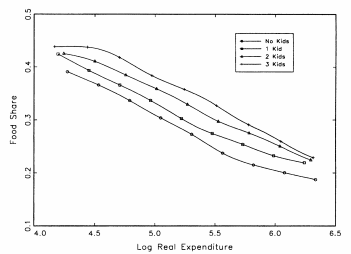

```{r setup, include=FALSE}
knitr::opts_chunk$set(echo = FALSE)
options(scipen = 999)
```

# Un poco de intuición

```{r, message=FALSE, warning=FALSE, out.width = "50%"}
library(ggplot2)
library(readr)
library(dplyr)
randomness<-read.csv("random.csv")
ggplot(randomness, aes(gasto_total_trimestral,tortilla))+geom_point() +  labs(y="Gasto trimestral en tortillas", x = "Gasto total")+ ggtitle("Gasto trimestral")+ theme(text = element_text(size=20), panel.background = element_rect(fill = "lightblue")) 

```
--
```{r, message=FALSE, warning=FALSE, out.width = "50%"}
ggplot(randomness, aes(gasto_total_trimestral,tortilla))+geom_point() +  labs(y="Gasto trimestral en tortillas", x = "Gasto total")+ ggtitle("Gasto trimestral")+ theme(text = element_text(size=20), panel.background = element_rect(fill = "lightblue")) +geom_smooth(color="purple",se=F)+stat_smooth(aes(y = tortilla),method = "lm", size = 1,color = "yellow", se=F)
```


---

# Un poco de intuición


```{r, message=FALSE, warning=FALSE, out.width = "50%"}
ggplot(randomness, aes(log(gasto_total_trimestral),tortilla))+geom_point()  +  labs(y="Gasto trimestral en tortillas", x = "Log(Gasto total)")+ ggtitle("Gasto trimestral")+ theme(text = element_text(size=20), panel.background = element_rect(fill = "lightblue")) 

```
--
```{r, message=FALSE, warning=FALSE, out.width = "50%"}
ggplot(randomness, aes(log(gasto_total_trimestral),tortilla))+geom_point()  +  labs(y="Gasto trimestral en tortillas", x = "Log(Gasto total)")+ ggtitle("Log (Gasto trimestral)")+ theme(text = element_text(size=20), panel.background = element_rect(fill = "lightblue")) + geom_smooth(color="purple",se=F)+
  stat_smooth(aes(y = tortilla),method = "lm", size = 1,color = "yellow",se=F) +
  stat_smooth(aes(y = tortilla),method = "lm", formula = y ~ x + I(x^2), size = 1, color = "red",se=F)


```


---

# ¿Cuál es el problema de Banks, Blundell y Lewbel?
--
<br>

Los autores notan que existe una relación cuadrática entre el logaritmo del ingreso y ciertas categorías de bienes, contradiciendo la linealidad supuesta.

--

Resolver el problema podría mejorar el análisis de bienestar, sin perder las herramientas de teoría económica.

--

Dilema:

--

.pull-left[
¿Debemos realizar una estimación fiel a los datos...

- Estimación no paramétrica nos lleva "por la libre"
- A costa de no adecuarlas a supuestos de maximización de utilidad, perdiendo la posibilidad de usar herramientas de teoría económica]

--

.pull-right[
...o fiel a la teoría?
- Consistente con teoría microeconómica y los avances en microeconometría

- A costa de realismo]

---
# Recapitulemos

--

Recordemos las curvas de Engel

--

```{r, message=FALSE, warning=FALSE, out.width = "50%"}
library(ggplot2)
fun.1 <- function(x) x
fun.2 <- function(x) -x^(1/2) - x+30

ggplot(data = data.frame(x = 0), mapping = aes(x = x))+ stat_function(fun = fun.1) + xlim(0,5)+ labs(y="Cantidad del bien", x = "Ingreso")+ ggtitle("Bien normal")+ theme(text = element_text(size=20), panel.background = element_rect(fill = "lightblue"))

ggplot(data = data.frame(x = 0), mapping = aes(x = x))+ stat_function(fun = fun.2) + xlim(0,5)+ labs(y="Cantidad del bien", x = "Ingreso")+ ggtitle("Bien inferior")+ theme(text = element_text(size=20), panel.background = element_rect(fill = "lightblue"))


```

---

# Recapitulemos

```{r, message=FALSE, warning=FALSE, out.width = "50%"}

fun.3 <- function(x) x^(1/4) - .01*x
fun.4 <- function(x)  x^2 + x

ggplot(data = data.frame(x = 0), mapping = aes(x = x))+ stat_function(fun = fun.3) + xlim(0,5)+ labs(y="Cantidad del bien", x = "Ingreso")+ ggtitle("Necesidad")+ theme(text = element_text(size=20), panel.background = element_rect(fill = "lightblue"))

ggplot(data = data.frame(x = 0), mapping = aes(x = x))+ stat_function(fun = fun.4) + xlim(0,5)+ labs(y="Cantidad del bien", x = "Log(Ingreso)")+ ggtitle("Lujo")+ theme(text = element_text(size=20), panel.background = element_rect(fill = "lightblue"))


```

---
# Recapitulemos

--

Si realizamos una transformación de las variables podemos obtener la siguiente gráfica (recordemos el efecto que tienen las transformaciones logarítmicas):

```{r, message=FALSE, warning=FALSE, out.width = "50%"}
fun.5 <- function(x)  .1*x

ggplot(data = data.frame(x = 0), mapping = aes(x = x))+ stat_function(fun = fun.5) + xlim(0,5)+ labs(y="Proporción de gasto del bien", x = "Log(Ingreso)")+ ggtitle("Curva de engel")+ theme(text = element_text(size=20), panel.background = element_rect(fill = "lightblue"))


```
--
```{r, message=FALSE, warning=FALSE, out.width = "50%"}
ggplot(randomness, aes(log(gasto_total_trimestral),proporcion_tortilla))+geom_point() +  labs(y="% Gasto trimestral en tortillas", x = "Log(Gasto total)")+ ggtitle("PIGLOG")+ theme(text = element_text(size=20), panel.background = element_rect(fill = "lightblue"))+ geom_smooth(color="purple",se=F)+
  stat_smooth(aes(y = proporcion_tortilla),method = "lm", size = 1,color = "yellow",se=F) +
  stat_smooth(aes(y = proporcion_tortilla),method = "lm", formula = y ~ x + I(x^2), size = 1, color = "red",se=F)


```


---
# Echemos un vistazo a los datos 

--

Banks, Blundell y Lewbel analizaron la encuesta de panel *UK Family Expenditure Survey* para cinco categorías de bienes entre 1970-1986. 

--

Para hacer el análisis exploratorio, partieron del modelo Working-Leser (especificación log-lineal en proporciones del gasto $w_i$) con métodos no paramétricos, donde cada $w_i$ se “deflacta” por un índice de precios.

--

 

---
# Echemos un vistazo a los datos 


---

# Tests para validar la hipótesis

A simple vista, ya era evidente que para algunos bienes, las estimaciones lineales no eran las más adecuadas.

--

Sin embargo, era necesario realizar pruebas para cerciorarse de que los hallazgos fueran robustos. Realizaron: 

--

- Prueba de rangos

--

- Prueba de endogeneidad

--

- Estabilidad de los resultados

Las conclusiones fueron que:
- Las  estimaciones lineales no eran suficientes para explicar el consumo
- Las elasticidades ingreso varían en diferentes niveles de ingreso
---
<br>

.pull-left[
]

.pull-right[
 ]

<br>
--
 

 
---

# Regresemos a la teoría del consumidor

¿Qué está pasando con los supuestos?

--

- Hay saciabilidad local para algunos bienes

--

- Las curvas de Engel no necesariamente son monótonas: hogares ricos y pobres pueden tener mismo gasto en ciertos bienes 

--

<br>

¿Es un supuesto realista? Depende el tipo de bien

---
# ¿Qué pasa en 1997 en microeconometría?

--

El análisis empírico existente no proveía una imagen realista de la conducta observada a través de diferentes grupos de ingreso y distintos tipos de bienes.

--

Algunos de los sistemas de demanda que se plantean relaciones lineales entre el logaritmo del ingreso o del gasto total y el consumo son: 

--

- Linear Expenditure System (LES)

- AIDS

- Working-Leser

- Translog

--

La idea de Banks, Blundell y Lewbel es modificar el planteamiento del modelo AI para contemplar la existencia del efecto cuadrático de $ln(m)$, creando el sistema de demanda QUAIDS.

---
# Reto: generalización de AIDS 

--

Las demandas que tienen ωi lineales en log(exp) (o log(m) por dualidad) vienen de la función de gasto “Price-Independent Generalized Logarithmic” (PIGLOG).

AIDS y Translog se basan en ellas.

--

Como algunos bienes se ven de esta forma, los autores deciden hacer una generalización de este modelo.
--

La forma de las demandas consistente con la evidencia empírica se ve de la siguiente forma:

$$w_i=A_i(p)+B_i(p)*ln(x)+ C_i(p)*g(x)$$

--

donde

$$x=\frac{m}{a(p)}; A_i(p);B_i(p);C_i(p) \text{ y }g(x) \text{ son funciones diferenciables }$$

--

La demanda del bien i depende linealmente de ln(x) y de una función g(m) que puede ser constante o depender de otros términos.

---
# Reto: generalización de AIDS 

--

¿Cómo podemos adecuar las demandas para que contemplen un término cuadrático y a la vez sean consistentes con la teoría del consumidor?

--

 Por un lado, todos los sistemas derivados de esta forma satisfacen  homogeneidad y simetría, por lo que son consistentes con la teoría del consumidor.
--
<br>

$$w_i=A_i(p)+B_i(p)*ln(x)+ C_i(p)*g(x)$$
<br>


--
<br>

Sin embargo, nos gustaría  tener más términos para poder realizar estimaciones más precisas.


---
# ¿Cuántos términos podemos agregar?

¡Alerta!

--

De acuerdo a la teoría económica (Gorman) y a las observaciones empíricas, el rango máximo posible en un sistema de demandas es 3; más términos no aportan mucho a la explicación. 

--
<br>

$$w_i=A_i(p)+B_i(p)*ln(x)+ C_i(p)*g(x)$$
<br>
--

La única manera de transformar el sistema a uno de rango 3 es si la función C se relaciona con una ln(m) y eso es posible solo si $g(x)=ln(x)^2$.


---

# Teorema

--
Las ecuaciones derivadas de un problema de maximización de la utilidad pueden tener la función C dependiente de los demás términos o cuadrática.
--
$$C_i(p)=d(p)B_i(p)$$
--

¿Pero cómo podemos plantear el problema para que esa C sea una función cuadrática de lm?
--

¡Dualidad!

Podemos plantear nuestro problema de maximización de tal manera que nuestra V contemple un $\lambda$:

--

$$ln(V)=\{[\frac{ln(m)-ln(a(p))}{b(p)}]^{-1}+\lambda(p)\}^{-1}$$

--

Donde el primer término viene de la especificación de AIDS y $\lambda$ es una función diferenciable y homogénea grado cero en p. Notemos que si $\lambda$ no dependiera de precios, sería una constante y regresaríamos a la forma de AIDS.

---

# Finalmente

--

Si utilizamos la identidad de Roy:
--
$$w_i=-\frac{\partial log V (p,m)}{\partial log(p_i)}/\frac{\partial log V(p,m)}{\partial log(m)}$$

--

Obtenemos la demanda en forma de $w_i$:

--
$$w_i=\frac{\partial ln (a(p))}{\partial ln(p_i)}+\frac{\partial ln (b(p))}{\partial ln(p_i)}ln(x)+\frac{\partial \lambda}{\partial ln(p_i)}\frac{1}{b(p)}ln(x)^2$$

--
que corresponden a la especificación con A, B y C y cuya especificación toma la siguiente forma: 

--

$$w_i=\alpha_i+\sum_{j=1}^n \gamma_{ij}ln(p_i)+\beta_iln[\frac{m}{a(p)}]+\frac{\lambda_i}{b(p)}\{ln[\frac{m}{a(p)}]\}^2$$

--

<br>

En resumen, debido a que tener un rango 3 obliga a que $g(x)=(ln(x))^2$ las proporciones de gasto son cuadráticas en el logaritmo del ingreso.

---

# Estimación

--

Recordemos que el modelo AI se estima con:

--

$$ln(V)=\frac{ln(m)-ln(a(p))}{b(p)}$$
 
--

donde

 $$ln (a(p))=\alpha_0+\sum_{i=1}^n\alpha_i*ln(p_i)+\frac{1}{2}\sum_{i=1}^n\sum_{j=1}^n \gamma_{ij}ln(p_i)*ln(p_j)$$

--
 y b(p) que es el *price aggregator*.
 
 $$b(p)=\prod_{i = 1}^{n}p_i^{\beta_i}$$

Este modelo es popular porqué cuenta con proporciones de gasto condicionadas a $a(p)$, son lineales en $ln(p)$ y $ln(x)$. 

--

Sin embargo, para aprovechar los términos cuadráticos tenemos que replantearlo de la siguiente manera.

---

# QUAIDS

--
Definimos nuestra función de utilidad indirecta ahora con la función $\lambda(p)$ dentro

$$(1)...ln(V)=\{[\frac{ln(m)-ln(a(p))}{b(p)}]^{-1}+\lambda(p)\}^{-1}$$

--
donde

.pull-left[
$$(2)...\lambda(p)=\sum_{i=1}^n\lambda_i*ln(p_i))$$]
.pull-right[
$$(3)...\sum_{i=1}\lambda_i=0$$]

--
<br>
<br>
 
$$(4)...ln (a(p))=\alpha_0+\sum_{i=1}^n\alpha_i*ln(p_i)+\frac{1}{2}\sum_{i=1}^n\sum_{j=1}^n \gamma_{ij}ln(p_i)*ln(p_j)$$
 
 $$(5)...b(p)=\prod_{i = 1}^{n}p_i^{\beta_i}$$
---
#Propiedades

Presupuesto balanceado (adding up conditions)

--
$$\sum_i\alpha_i=1;\sum_i\beta_i=0;\sum_i\lambda_i=0$$

--
Simetría de Slutsky
--
$$\gamma_{ij}=\gamma_{ij}$$
--
Homogeneidad

$$\sum_i\gamma_i=0$$
--
Matriz de Slutsky negativa semi-definida (se debe probar)

---
# Elasticidades

--

Las elasticidades de este sistema tienen la siguiente estructura:

--

$$\mu_i=\frac{\partial w_i}{\partial ln(m)}=\beta_i+\frac{2\lambda_i}{b(p)}\{ln[\frac{m}{a(p)}]\}$$

--

$$\mu_{ij}=\frac{\partial w_i}{\partial ln(p_j)}=\gamma_{ij}-\mu_i(\alpha_j+\sum_{k}ln(P_k)-\frac{\lambda_i\beta_j}{b(p)}\{ln[\frac{m}{a(p)}]\}^2$$

--

Donde la elasticidad de $w_i$ es:

--

$$e_i=\frac{\mu_i}{w_i}+1$$
--
La elasticidad precio no compensada de $w_i$ es:
--
$$e_{ij}^u=\frac{\mu_i}{w_i}-\delta_{ij}$$
--
y la compensada: 
--
$$e_{ij}^c=e_{ij}^u+e_iw_j$$

---

#Elasticidad en QUAIDS

--

Las elasticidades, empíricamente, no siempre son constantes entre los diferentes grupos de ingreso: la forma funcional flexible que proponen Banks, Blundell y Lewbel permite que las $\mu_i$ sean diferentes en hogares con diferentes ingresos:

--

Cuando el termino cuadrático está activado

--

$$\lambda<0;   \beta>0$$

--

Lo cual implica que $\varepsilon_I>1$ en niveles bajo de gasto, pero al aumentar este, $\varepsilon_I$ tenderá a hacerse <1 

--

A niveles de $log(gasto)$ bajos, estos bienes serán lujos; si ocurre en un nivel mayor de $log(gasto)$, los bienes son necesarios.

Asimismo, $\varepsilon_I$ suele variar por características socio-demográficas, por ejemplo el entorno (rural o urbano). 
---

# Elasticidades compensadas

--

Las elasticidades compensadas miden el porcentaje de cambio en $w_i$ si los precios suben 1%. 

--

- Miden solo el efecto sustitución 

--

- En este caso, la $\varepsilon$ precio propia siempre es no-positiva

--

- Se utilizan también para calcular las elasticidades precio cruzadas, para poder determinar si los bienes son sustitutos o complementos netos.

--

- Son necesarias para poder llevar a cabo el análisis de bienestar 

---
# Resultado de estimaciones

--


---


# Resultado de estimaciones


---

# Resultado de estimaciones


---

# Resultado de estimaciones

<br>
--


---
# Análisis de Bienestar

--

Los autores decidieron utilizar una variación compensatoria:

--

Primero, para calcular el cambio en bienestar por el impuesto simulado, tendría que obtener el nivel de gasto en la fecha posterior que da el mismo nivel de utilidad que el año inicial,  con los precios nuevos. 

--

Para obtenerlo, se debe calcular para cada hogar la función de utilidad indirecta (con el término adicional), antes y después de los precios de la siguiente forma, igualarlas y despejar el gasto : 

--

$[\frac{ln(x_o)-ln(a(p_o))}{b(p_o)}^{-1}+\lambda(p_o)]^{-1} = \frac{ln(x_1)-ln(a(p_1))}{b(p_1)}^{-1}+\lambda(p_1)]^{-1}$

-- 

Para poder posteriormente restar las funciones de gasto:
    
$$e(p_1, z,u_o) - c(p_o, z, u_o)$$

Cuyo término $z$ implica a las variables demográficas.

---

# Pérdida de bienestar: QUAIDS vs AIDS

--

Todos los hogares tuvieron una pérdida en bienestar. En términos absolutos, las pérdidas se ven así:  
--  


---
<br>

Al comparar los resultados que se habrían obtenido con AIDS


--


--
<br>

Notamos que la pérdida en bienestar: 
- Está sobre-estimada en los hogares más ricos y más pobres 
- Está subestimada en los hogares de ingreso medio

---
# Conclusión
--

Se puede tener un sistema de demanda consistente con la teoría, o integrable, que permita a las $w_i$ a responder de forma flexible  a los precios respecto al gasto total incluyendo términos cuadráticos en $log(m)$, partiendo mínimamente del modelo lineal, si:

--

+ Los términos no lineales son, como máximo, cuadráticos en log($m$) de orden 3.

--
+ Se permite que los coeficientes del término cuadrático varíen con los precios

--

De esta manera, los términos cuadráticos permiten identificar bienes necesarios y lujos; realizar estimaciones más acertadas y en consecuencia, estimar medidas de bienestar que capten precisamente las curvas de Engel.

---